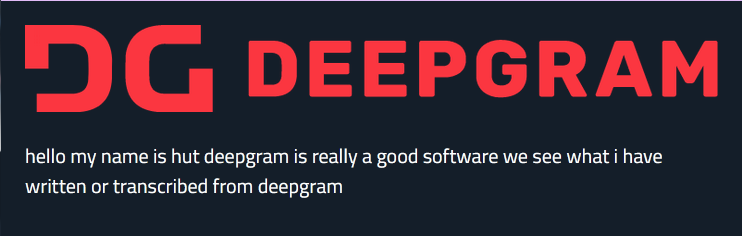
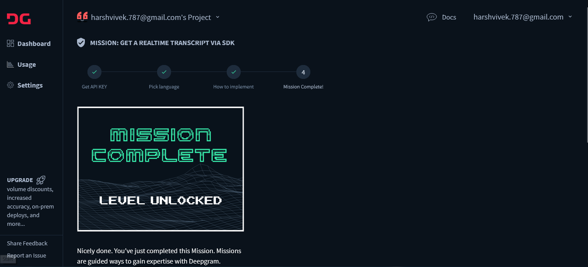

## 
Deepgram - Live and Pre-recorded transcription tool 

  

## Result 

> 

## Deepgram Dashboard 

> 

### Requirements

You need your secret API key from [Deepgram](https://console.deepgram.com/) in order to run the project.

## Run the code 
- For Live Transcription, Run [index.html](index.html)

- For pre-recorded audio Transcription, Run [recorded.js](recorded.js)
